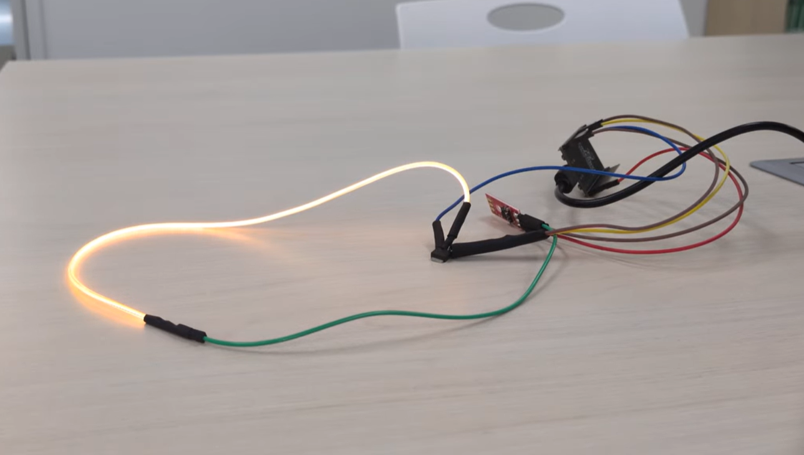

# 🚻 Toilet Notification System

ESP32を使用したトイレ使用状況通知システムです。

照度センサーでトイレ内の照明を監視し、使用中・空きの状態をWi-Fi経由で別のESP32へ送信します。受信側ESP32はLEDを点灯・消灯し、トイレの使用状況を離れた場所から確認できます。



## youtube_実際の動作確認動画
https://www.youtube.com/shorts/MFViIbvx_ls

---

## 使用技術

* ESP32
* Arduino Framework
* Wi-Fi
* HTTP通信
* OTA (Over The Air)
* 照度センサー
* LED

---

## システム構成

```text
照度センサー
      │
      ▼
ESP32（送信側）
  ・照度を1秒ごとに取得
  ・3回連続で判定
  ・HTTPで状態送信
      │ Wi-Fi
      ▼
ESP32（受信側）
  ・HTTPリクエスト受信
  ・LED ON/OFF
```

---

## 動作

### 使用中

照度がしきい値未満の場合、トイレを使用中と判定します。

```
GET /led?state=1
```

受信側のLEDを点灯します。

---

### 空き

照度が3回連続でしきい値以上になった場合、空きと判定します。

```
GET /led?state=0
```

受信側のLEDを消灯します。

---

## 工夫した点

* 3回連続で判定することで、一時的な照度変化による誤検知を低減
* Wi-Fi経由でESP32同士をHTTP通信
* OTAに対応し、USB接続なしでプログラム更新可能
* Wi-Fi接続処理・OTA処理をライブラリ化し、再利用しやすい構成にした

---

## 今後の改善案

* Web画面で使用状況を確認
* MQTT対応